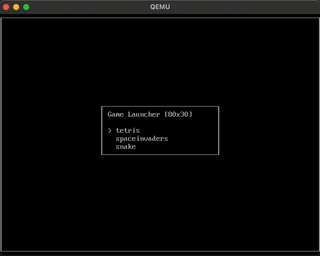

# Embedded ASCII Slot Machine

Embedded ASCII Slot Machine is a small (but easily extendable) collection of classic ASCII games running on top of a tiny linux kernel bundled into a single bootable iso for aarch64 and x86_64 architectures. The project was meant to be for fun and learning.

<table>
  <tr>
    <td align="center"><br>Tetris</td>
    <td align="center"><br>Space Invaders</td>
    <td align="center"><br>Snake</td>
  </tr>
</table>

## TL;DR

```sh
scripts/setupenv.sh                 # 1. Build docker build environments

scripts/build.sh                    # 2. Build iso image

scripts/aarch64/qemu_boot_iso.sh    # 3a. Boot iso image with qemu aarch64
scripts/x86_64/qemu_boot_iso.sh     # 3b. Boot iso image with qemu x86_64
```

## Prerequisites

- [Docker](https://www.docker.com): Build environment is based on docker services and docker platform emulation
- [QEMU](https://www.qemu.org): Boot the iso within an emulated aarch64 or x86_64 machine

## How to build

### Automated build using GitHub Actions

- After push to main branch a build of the isoimage is triggered by `.github/workflows/CI.yml`.
- After pushing a version tag in the form of `v[0-9]+.[0-9]+` a release is triggerd by `.github/workflows/Release.yml`.

### Manual build

Build docker build environments:

```sh
scripts/setupenv.sh
```

Trigger a full build using docker via `scripts/build.sh`. This may take a while as docker images need to be build first, including kernel `git clone`. Furthermore, build environments for non-compliant host architectures will be emulated by docker.

```sh
scripts/build.sh
```

Or bash into a specific build environment and `make` manually. This example randomly uses the aarch64 build environment.

```sh
scripts/aarch64/buildenv_bash.sh    # bash into aarch64 build environment

make uki                            # build unified kernel image uki-aarch64
make isoimage                       # build iso image cdrom.iso which includes uki-aarch64 (and uki-86_64 if present)

make                                # OR: default target is shorthand for `make uki` and `make isoimage` 
```

## How to play

### QEMU

If `out/cdrom.iso` was built, run one of

```sh
scripts/aarch64/qemu_boot_iso.sh
scripts/x86_64/qemu_boot_iso.sh
```

Make sure EFI firmware is available at `EFI/` first. Should be the case by default. Otherwise run:

```sh
scripts/efi_reinstall.sh
```

### Real hardware

Put iso image on a USB stick or other bootable medium. Hardware must have UEFI (no BIOS supported) as UEFI allows a framebuffer console using GOP/simpledrm w/o any specific graphics driver in the kernel.

## Project overview

### Project outline

```
EmbeddedSlotMachine/
├── EFI/                    # EFI firmware to boot iso with qemu
├── out/                    # Build artifacts: cdrom.iso, uki-aarch64, uki-x86_64
├── rules/                  # Additional make scripts
├── scripts/                # Convenience scripts to work with project
├── SlotMachine/            # C++ games collection "Slot Machine" as only user space binaries
├── Makefile                # Top-level make file (to be used within docker build environment)
├── config.mk               # Global build configuration
└── Dockerfile              # Dockerfile for aarch64/x86_64 build environemts
```

### Build artifacts

Main build artifact is the bootable multi-arch iso image `out/cdrom.iso`. Kernel images are bundled with user space (=SlotMachine games collection) and command line arguments into one EFI executable file.

```
EmbeddedSlotMachine/out/
├── uki-aarch64             # Unified kernel image for aarch64
├── uki-x86_64              # Unified kernel image for x86_64
└── cdrom.iso               # Bootable (multi-arch) iso containing at least one kernel image
```

### Scripts

Core functionallity is available via shell scripts. Scripts must be called from project root!

```
EmbeddedSlotMachine/scripts/
├── aarch64/                # aarch64 specific scripts
│   ├── buildenv_bash.sh    # Interactive shell into aarch64 build environment
│   └── qemu_boot_iso.sh    # Boot iso with qemu aarch64
├── x86_64/                 # x86_64 specific scripts
│   ├── buildenv_bash.sh    # Interactive shell into x86_64 build environment
│   └── qemu_boot_iso.sh    # Boot iso with qemu x86_64
├── build.sh                # Trigger full build
├── clean.sh                # Clean build artifacts in out/
├── efi_reinstall.sh        # Replace EFI/ with latest firmware from build environment
└── setupenv.sh             # Build docker build environments
```

## How to add more games?

1) Copy & paste one of the existing games in `SlotMachine/src` folder
2) Adapt folder name and variables in `config.mk`. Build system will pick up the new folder automatically and add it to the collection.
3) Modify the C++ source code until your game is ready ;)